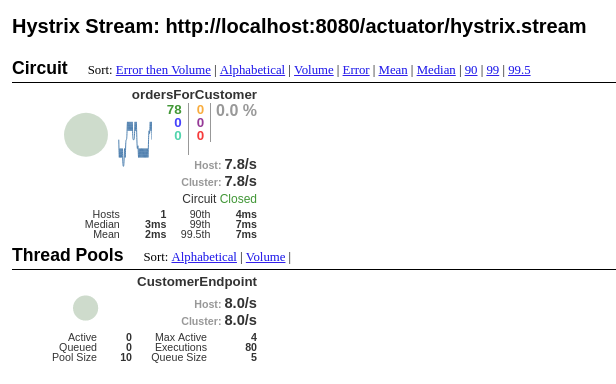
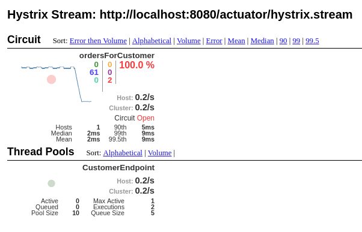

## Circuit Breaker and Hystrix Dashboard

Customer service runs on ```localhost:8080```   
Order service runs on ```localhost:8081```    
Hystrix dashboard is located at ``` http://localhost:9090/hystrix```

To run service test run command:   
```watch -n1 curl http://localhost:8080/customer/1/orders```   
It will run REST endpoint every second returning orders for customer.

 

After stopping Order service hystrix will return empty orders list from Customer service fallback method.

 