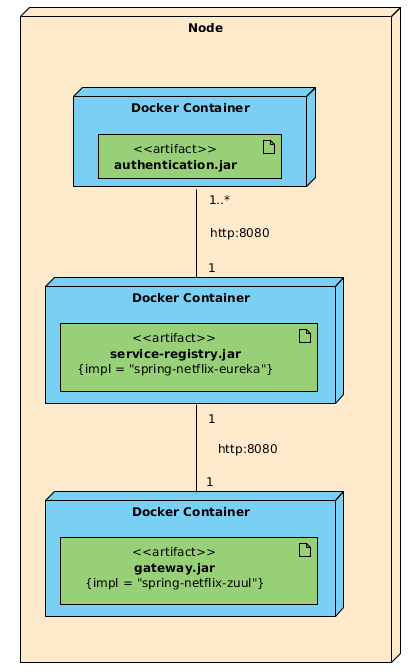

Service failover and load balancing using Netflix Zuul.
 
 

For failover to work properly spring-retry dependency inclusion is mandatory.

`<dependency>
    <groupId>org.springframework.retry</groupId>
    <artifactId>spring-retry</artifactId>
</dependency>`

Also by default only GET request are retried. For retrying other type request we must include property:

`ribbon:
   OkToRetryOnAllOperations: true`

 Build:  
 `./mvnw clean package -P dockerize`
 
 Run:  
 `docker-compose up --scale auth-service=2`
 
 To test run curl command:  
 `curl -w "\n" --header "Content-Type: application/json" --request POST --data '{"username":"john.doe","password":"test"}' http://localhost:9090/authentication`
 
 After some time stop first instance of auh-service and check again if failover is working with above curl command:  
 `docker stop service-failover_auth-service_1`