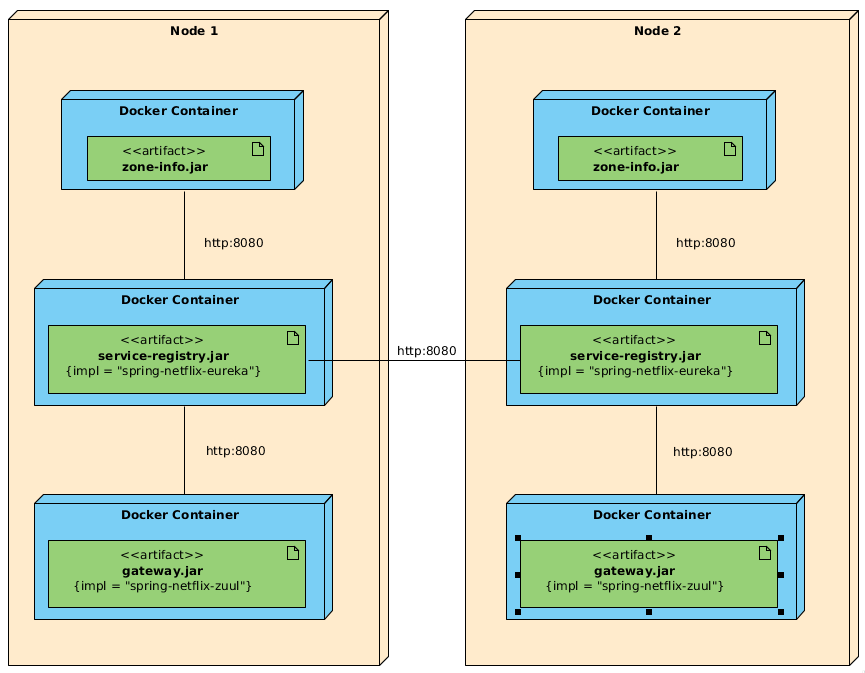

 Zone affinity example based on eureka-service-registry and eureka-zuul.
 
 
 
 Build:
 `./mvnw clean package -P dockerize`
 
 Run:  
 `docker-compose up`  
 
 or with zone-info service scaled up:  
 
 `docker-compose up --scale zone-info-1=2 --scale zone-info-2=2`
 
 
 Pointing to zone-1 instance of gateway (zuul) returns responses from services in zone-1:
 
 `Service is in zone-1. Service ip:172.22.0.4`  
 `Service is in zone-1. Service ip:172.22.0.5`
 
 and equally zone-2 gateway from zone-2:
 
  `Service is in zone-2. Service ip:172.22.0.6`  
  `Service is in zone-2. Service ip:172.22.0.7`